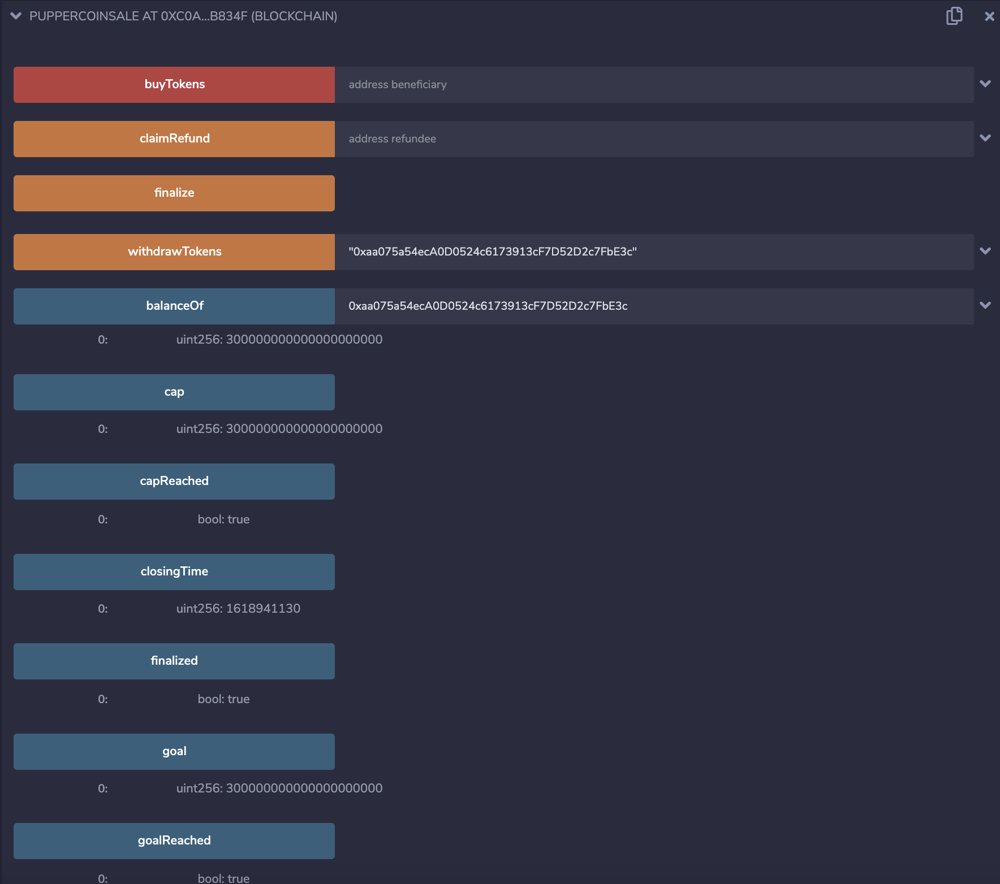
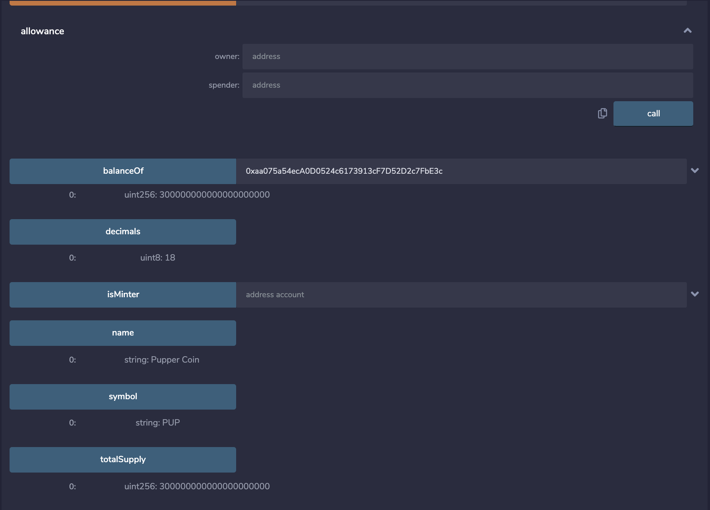

# Unit 21

## Live Kovan Coinsale Deployer

https://kovan.etherscan.io/tx/0x81512d018ed662106d28f7a99780ecf32c5e38fae24351afe5912912df4e252c

## How it works

- Deploy the Coinsale Contract at 0x26454fab49FF60d1e0ad174326F4718Ae7347d92
    - https://kovan.etherscan.io/address/0xe779a3dce63d94e9118852585a7cac4c5cce8e09
- Run the Buy Tokens Method
- Once the Crowdsale is finalized you can withdraw Tokens

## Token Parameters

- Name:  Pupper Coin
- Symbol:  PUP
- Crowdale Cap:  300

## Coinsale Images

### Address of Coinsale Deployer on Local Test Network

- 0xc115E047dD8F74a4eAd367D0fBfF854c5949d6b0

## Address of Pupper Coin on Local Test Network

- 0x2C73b0071B39079050c9DEd53eA96cfB4E605c6C

## Proof of Coin Distribution on Local Test Network

- 0x2C73b0071B39079050c9DEd53eA96cfB4E605c6C

